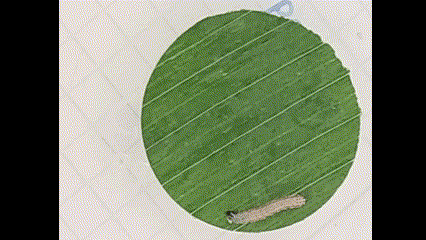

# Measurement of the Length of Spodoptera frugiperda Larvae

The measurement of length in larval stage individuals is one of the most commonly used criteria for monitoring growth and development in insect species that include this stage in their life cycle. This is the case for *Spodoptera frugiperda*, an insect of the order Lepidoptera, whose larval phase is divided into 6 main instars, each described with an approximate length. Although this measurement is a typical protocol for monitoring the life cycle of the larva, it can become methodologically challenging due to the high mobility of the larvae and their tendency to curl and fold.

The following code provides a simple tool to measure the length of larval stage individuals from photographic material. For the implementation of this code, it will be necessary to have a scale in the photographs, such as a grid with known dimensions.


## Requirements

This code is written in Python and uses the following packages:

- `cv2` (OpenCV) – Image processing package.
- `math` – Mathematical functions module.

You can install the required dependencies using `pip`:

```bash
pip install opencv-python
```
# Usage
- Make sure you have a photograph of the larva with a known scale (for example, a grid with known distances in the image).
- Place the image file at the path specified in the code (you can change the image path in the ruta_imagen variable).
- The code will prompt you to adjust the scale of the image by selecting two points with a known distance available in the image. Once the two points were selected, close the window to set the scale.


    
- Then, a new windows will appear, where you can measure the length of the larva by clicking along its body. Once you completed this step, close the window to see the measurement result.

    
- The code will calculate the larva's length in centimeters, using the established scale.

Note: The recommended maximum image dimension for it to display fully is 975 pixels in width or height, due to OpenCV limitations. If the image is too large, it is recommended to resize it to fit this size.

# Code Details
- Scale Adjustment: By clicking the left mouse button on two points in the image, the code will calculate the distance between these points and adjust the scale (in pixels per centimeter).
- Larvae Length Measurement: You can click multiple times on the image to mark points along the body of the larva. The code will calculate the distance between each pair of points and sum these distances to obtain the total length of the larva.
  
# Limitations
- The quality of the measurement will depend on the precision in selecting the points on the image.
- The image must have a known scale that can be used to convert the distances from pixels to centimeters.

# Code Testing
- Images suitable for testing the code can be found in [test_images](test_images) folder.

